# RMTC Technical Notes 

## Introduction 

RMTC is an AI artifact tracking, training & inferencing system developed initially by Wētā FX and open sourced under Apache-2.0 via The Academy Software Foundation. RMTC’s chief purpose is in managing AI artifact provenance to help protect artist and studio interests. 

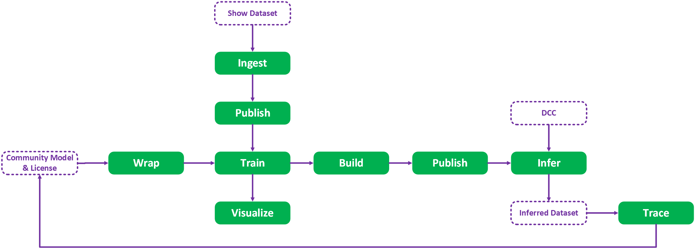

The intent is allowing a facility to trace an inference, back up through all the steps to the source and any licenses 

### Project Status

RMTC is considered pre-Alpha, it has not been tested in production and is under active development. No warranty of any kind is provided – see Apache-2.0 license. 

### Document Purpose

This document follows a technical notes format on each of modules of the implementation to give you a sense of how RMTC works. 

It is the partner document to the initial develop branch release to the ASWF GitHub and is intended to be read alongside the code to provide insights into each of the modules, it is not class documentation – docstrings are present on almost all the Python classes. 

### Key Concepts 

#### Provenance & Permissions

Artifacts are all attached to a license and permission system with object properties having provenance specific features for detailed tracing back to source. Permissions help control usage and access and are attached to the source licenses. 

#### Immutability

To protect provenance and history – Artifacts in RMTC are immutable and should not be deleted. 

#### Data Minimisation

RMTC strives to reduce the amount of data in the local system by using: 

* Just in time storage queries 
* Partially synced data 
* Reversed 1:1 relationships (rather than 1: Many) 

### VFX First

EXR, USD assets, DCC integration – show and pipeline concepts are all first-class citizens in the system. 

### Injection & Deferral 

Classes are intended to be injected into the system with significant amounts of deferral. The object hierarchy is relatively shallow, and classes are split into functional responsibilities – IO, inference, training etc. 

### Standardization 

Tensors & assets all follow a standard representation with last minute conversion to model types using processes owned by the model. Asset tensors standardize to optimal inference formats – e.g. HWC rather than CHW. 

## Code Structure 

RMTC is currently a set of Python modules split into 2 main modules: 
* RMTC – general systems and abstractions 
* RMTC Core – specific extensions to RMTC 
There is also a ‘bin’ folder for GUI tooling. 

### The Sandwich 

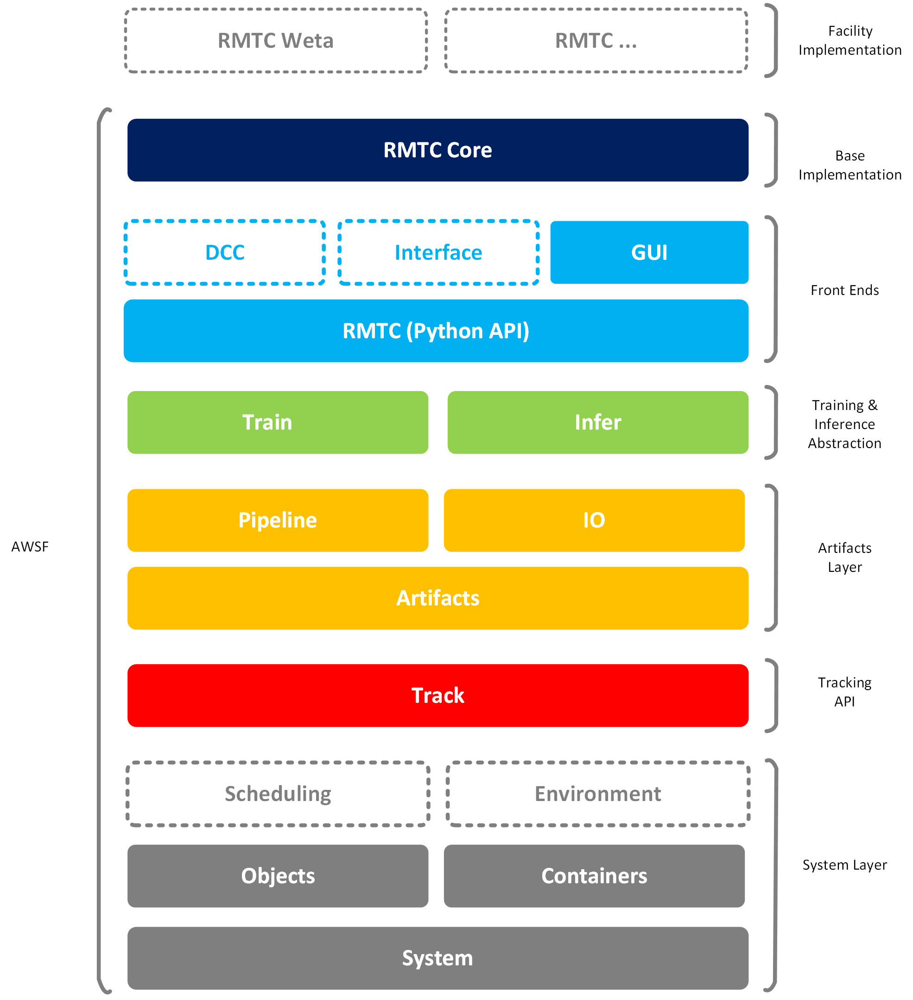

### RMTC vs RMTC Core 

The division between RMTC & RMTC Core is fuzzy, with the general rule that technology specific extensions (OIIO, TensorBoard, PyTorch etc.) are contained within RMTC Core as well as any systems that would expect to be overridden by each facility – for example the Asset Management pipelines. 

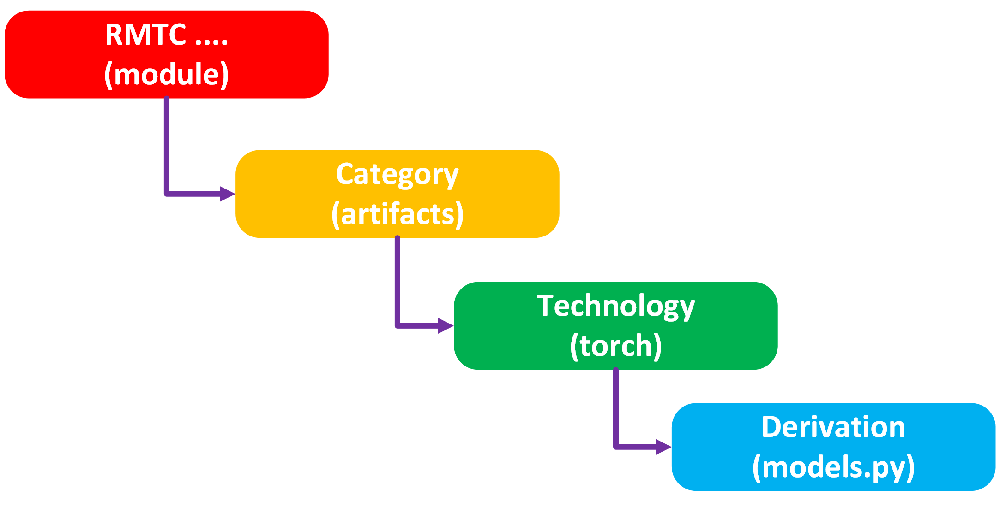

The code is generally structured by technology, an RMTC Core submodule will contain each technology that extends RMTC as a subfolder for example to extend the model class in RMTC we would have a matching structure in RMTC Core that looks like this: 

### Testing 

Tests are split between integration and unit – which are a rough and somewhat inaccurate division. Unit contains basic tests that slowly build up and Integration contains more complex cross module tests. 

### Linting & Formatting 

Code is automatically formatted via Black so manual formatting is not a concern. A linting file for pylint is setup to assume a rating of 10.0. 

### Resources 

A res folder contains any of the none-code resources – config files, images and icons. These should be installed alongside the application with the RMTC_RES env var set. 

## Examples 

To provide some guidance about how to use RMTC – there are a set of examples in the repo: 

* Basics - covers simple delete and add operations 
* Image2Image – provides the skeleton for training an image conversion model (requires a pre-packaged image to image PyTorch package model and an EXR image dataset) 
* MNIST – a full example for categorising the public MNIST image dataset (requires download of the MNIST dataset) 
* Tracking – lower-level DB operations directly on the store 
* Pipeline – example of fictious asset manager build and publish 

### Example Usage 

The general style in the examples follows a vertical delimited format. 
```python
rmtc_sys            = System()

oss_license         = rmtc_sys.create_license(community_licenses.OSS,
    name            = "Apache-2.0", 
    uri             = URI("https://apache.org/licenses/LICENSE-2.0.html"),
    parties         = ["Mozilla Foundation"],
)

model               = rmtc_sys.create_model(track.Model,
    name            = "Foundation Model",
    uri             = URI("https://github.com/foundation_model"),
    author          = "Big Tech",
    licenses        = [oss_license],
)  

dataset             = rmtc_sys.create_dataset(track.Dataset,
    name            = "Test Data",
    uri             = URI("file://localhost/testdata"),
    licenses        = [oss_license],
)  

solution            = rmtc_sys.create_solution(
    name            = "Test Solution",
    uri             = URI("/proj/rmtc/solutions/test"),
    input_type      = artifacts.Image,
    output_type     = artifacts.Image,
    description     = "Example Solution",
)
solution            .add_models([model])
solution            .add_datasets([dataset])

run                 = rmtc_sys.create_run(
    solution        = solution,
    name            = "Test Run 1",
)

rmtc_sys            .push()
```

## Modules 

The following section provides notes on each of modules in the lib folder. 

The general pattern of usage is to create an instance of a System object – which takes in instances of various subsystems. System holds a local representation of objects in RMTC, and you use this instance to create or pull tracked artifacts, kick off training or inference then push the System instance to the remote store. 

For example, to create a simple model wrapper: 
```python
rmtc_sys = rmtc_core.System() 
rmtc_sys.create_model('Test Model')
rmtc_sys.push() 
```
For convenience, an RTMC Core System object instantiates common subsystems for you. 

### System (class) 

System is considered the ‘main’ for RMTC and holds the primary methods for interacting with the framework. System allows you to specify the following: 

* Store – the abstracted storage system that is pushed and pulled from 
* Config – a dict that is derived from a YAML file to define global settings 
* Objects – the local list of database entities 
* Log – the log abstraction 
* Tracker – the general tracking system for training 
* Asset manager – way to resolve asset manager URIs to concrete filesystem URIs as well as how to run the build and publish pipeline 
* Environment manager – how to resolve artifact environments for instantiating any external dependencies (not currently implemented) 
* Broadcaster – the internal event notification system 
* Factory – the system to resolve a type name to an actual class 

Core defines defaults for the above and each can be passed in during instantiation of the System class. 

## System (module) 

System contains the basic shared elements for datatypes and configuration. 

### Factory, Type Names & Resolution 

Every Entity needs to have a Type Name which is exposed to RMTC via a YAML module definition.  

This Type Name follows the format: 

`<module>.<category>.<name>[.<version>]`

This type name has a mapping which connects it to the concrete Python class it will instantiate and acts like a whitelisting technique and way to identify implementations independently of their module import paths.  

Type Names can be deprecated and version-less – in which case the latest version is used. 

Factory takes these type names and resolves them to a concrete class path before importing and instantiating the class. 

### Modules

The factory populates the modules using YAML files that are found via the ```RMTC_MODULES``` envvar path.

To expose a new model type for example - you require a new module:

```yaml
_type:            module # module YAML type
_version:         1.0.0
_name:            rmtc # module name

Model: # category
  Model: # name
    version:      1.0.0
    display_name: "Tracked Model"
    class_path:   rmtc.track.Model
```

Only classes that are exposed in module definitions are able to be serialised to and from the store.

### Configs 

System defines a config type which allows a client to specify the store, credentials and various systemic behaviours. 

These are contained in a YAML file that is found either in the local working directory or through the ```RMTC_CONFIG``` envvar. Which is useful to allow for testing by creating a config in the current testing folder. 

For example to set up store credentials:

```yaml
_type:          config # required
_version:       1.0.0
_name:          rmtc

rmtc_store:
  type:         age
  username:     john
  password:     password1!
  uri:          postgres: //apache-age.studio.com:1234
  name:         rmtc
```

You also can define the JIT sync operation, system mode (determines if the system is a test/dev/prod client) and log levels – consider these the RMTC settings. Anything set in this config is visible in the config dict - all of which can be overriden in the Config constructor.

### Complex base types 

System defines the basic property classes that are considered native to RMTC – URI, Datetime & Version – these are derived from associated Python base classes. 

* URI – is a fully qualified resource that has an interrogable param string. 
* Datetime – is the timestamp system that uses ISO UTC 
* Version – semantic versioning system 
* Package – a package and version reference 
* Type – type that works in conjunction with factory to instantiate classes, can define a default or abstract type 

### Logging 

Logging is supported via the Python Logger and the associated Tracker. Log levels can be defined in the YAML config file. Loggers can also broadcast log events. 

### Events & Broadcasting 

A simple broadcaster class in System allows any object to send events of a specific type. The types of messages are generally defined as an Enum. Broadcasters can be enabled and disabled for all messages. 

A listener registers to listen to a specific message by registering a callback. It is good practice to remove your callback on destroy. 

This class can be significantly improved upon and likely re-implemented with a standard lib. 

## Containers 

Containers is a lean module that contains the general-purpose representations for correlative datasets – though they can be used independently. 

### Tables 

To support general iteration of datasets we have a table structure that allows you to add and remove row entries as lists of columns to a table. A table has associated iterators that allow a client to stripe and interlace asset lists to replicate a multidimensional structure. 

The table representations come in handy to abstract a trackable Dataset of a linear set of assets so they can be treated as correlated assets without having to change the underlying representation. 

The table interface does somewhat overlap tensor responsibilities. 

## Objects 

Object module manages classes related to the base object property system which is shared amongst almost all RMTC items. 

### Object vs Entity vs Artifact 

There is a general 3 tier object hierarchy in RMTC. 

Objects own properties and can broadcast updates and changes, they each have a name and a unique UUID4 ID. 

Entities derive from Objects are replicated in the store and can be fetched, synced, updated, created and destroyed. These represent more abstract trackable ancillary items such as processors, IO and such. 

Artifacts are the high-level Entities that represent a resource with a URI, hold a License and can be read/written to and from the URI using an IO object. These are your core trackable items in RMTC – models, datasets, assets etc. 

### Object Properties 

Objects have an internal property system which allows you to define a property of the following types: 

* Bool 
* Number - floating point number
* Integer 
* String 
* Datetime – standard ISO UTC time zone string 
* Object – a reference to another RMTC object 
* URI – a fully qualified resource 
* Version – semantic version stored as a string 
* Type – a meta type name that works with Factory to resolve to a concrete type 
* Package – a versioned package name used for environments 
* Enum – a fixed list of values from a Python Enum 

Properties are currently defined on an object instance basis – via add property: 

```python
obj.add_property(“test”, int, 123) 
```

Altering a property is done via the actual name as if it was a standard Python e.g. a property of type: 

```python
obj.test = 456 
```

In addition, properties can be marked with a direction, deprecated status, required status and membership – detailed later. 

### Arrayed Properties 

The property type is defined as a python class type and supports arrays: 

```python
obj.add_property(“test”, [int], [123]) 
```

Properties can be interpreted as a value or array – a value accessed like an array will only operate on the first element, removal and append do nothing. There are specific accessor classes to manage array append and remove which correctly manage and notify any changes – avoid add or remove to array properties directly – this may be changed to tuples in the future to prevent this. 

### Property Types & Conversion 

Properties are strongly type – they cannot change type by assigning to a different value – they will attempt to run a conversion via the “_convert” method. If a conversion is not possible it will assign the property default. 

The _convert method is often a source of bugs – when something isn’t quite operating as expected it is likely due to a subtle type change occurring in the _convert. 

### Volatile Members vs Properties 

Properties are considered persistent – they are pushed up to the store. For temporary volatile data, objects should use standard python members – which require a "_” prefix so they are distinguished internally from properties. 

Artifacts need to store their concrete data as volatile Python data which is loaded, used and unloaded during training for memory purposes. For example, a PyTorch model or Image Tensor. 

RMTC uses a basic duplication system to copy property data rather than deep copy as may PyTorch classes cannot be easily copied in such a way. The properties are copied and the volatile data is reconstructed on read. 

### Members & The ‘DOM’ 

Any property can be marked as a member – by default they are.   

A member means that the property is considered inalienable and part of the object and determines the ownership of entities in the local system object structure. A member will appear in the property editor window directly; it will be pulled with the entity from the store. The Objects instance stores references to all Entities in the system. 

The system owns an Objects instance which is considered our ‘DOM’. It is a loose object model since we want to be able to store artifacts in multiple ways with many kinds of ownership – a model zoo, a structure solution with models etc. In general key entities like models and datasets exist in the store objects instance as a root object – it owns the child members and so on. 

## Track 

Track is the core of RMTC – registering models, querying datasets and storing this data in a remote store. 

### Entity 

An entity in RMTC is a stored object – its properties are duplicated across to the store. A client can create entities and fetch them. An entity monitors its properties so when something is accessed it will sync the remaining properties if not already pulled from the store. If a property is updated, it will flag itself for update later. 

An entity can have its sources and derivatives traced up and down the provenance tree – in which case it will defer to the store if the IN or OUT properties are not immediately available – this may incur a large pull. 

An entity has a named ‘category’ this is used in the Type Name in the factory to determine which class of item to instantiate. This is currently a string – however it should be reduced to an Enum. 

Entities can have basic POD properties added to them – currently Object properties cannot be stored so any additional reference is required to be added in the init of a derived entity. 

### Schema

Entity properties are currently defined within the instances themselves - ideally this would be moved to the YAML definitions and shared for memory efficiency.

The schema is detailed here: [Entity Schema](entity_schema.yaml)

### Immutability 

Immutability is important to provenance – a dataset or artifact cannot change once ingested, otherwise the provenance information is lost. To augment or tweak entities – additional variants, ancestors or new entities must be created. We have structured the properties so that once created we don’t add or remove elements to that Entity (e.g. a Solution doesn’t have Runs added to it). 

Equally Entities are never deleted and can only be deleted under System modes related to testing. 

### Tracking Independence 

Given RMTC has several audiences it is entirely possible to use the base Tracking Entities without using the inference or training modules. 

This enables researchers to integrate RMTC into their own pipelines and populate the stores using the Tracking portion of the System instance. 

### Provenance 

Provenance is a core feature of tracking and as such there are specific structures to support it – primarily that objects properties have a direction: 

* IN – the property is an input to the object 
* OUT – the property is an output from the object 
* INOUT – the property is both an in and out 

These have various effects – especially when used in relation to Object references in which case input properties are considered sources in the provenance tree; output properties are considered derivations in the provenance tree. 

Since we target specifically a Graph DB as our store – these IN/OUT relationships can be managed directly in the directed connections of the DB.  

Sources and derivations of any given entity can be found through the System object – which traces the structure. 

In the example below Run owns both the OUT properties, Inference own the IN and OUT properties – you can see this ensures the relationships are intuitive, yet we don’t pull extensive amounts of entities when we sync – pull a Dataset and it won’t pull all the Inferences that use it because it has no relationship – it is contained wholly in Inference. 

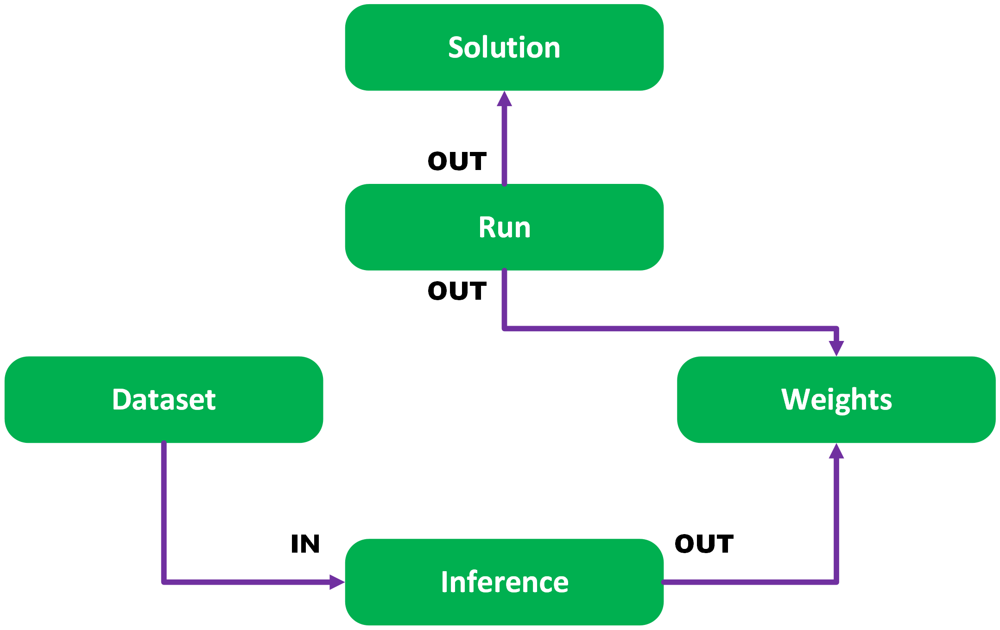

Direction also dictates where on any DAG style UI the properties appear – left for IN and right for OUT. 

## Stores & Store Names 

Stores are where entities are persistently held. A store is a remote interface that is connected to using the credentials in the config YAML file. In addition, a store name is defined in the config – this is used to partition the store into smaller chunks – allowing you to act upon just test data, or specific data for a show. Entities are stored in a particularly named store and can only interact or connect with other entities in that same named store. 

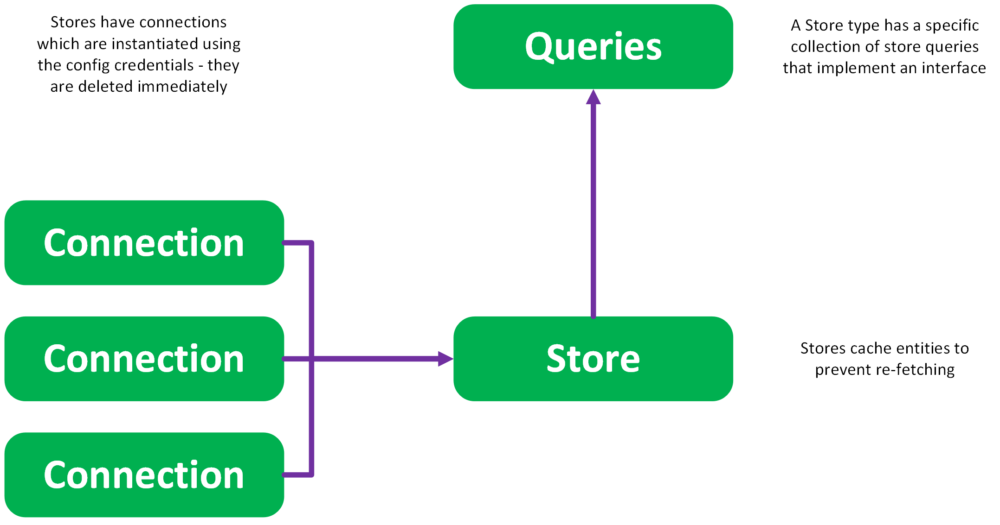

To implement a store, you are required to derive from the Store class, implement a connection object and satisfy queries. Note that a store isn’t just a database – it could easily be a JSON file. 

### Fetch, Sync & Update 

RMTC uses an adapted CRUD model for working with a store – CREATE, UPDATE, SYNC, FETCH, DELETE. Note that the name READ is reserved for operating on URIs with the IO objects and in RMTC; SYNC performs equivalently to a READ operation. 

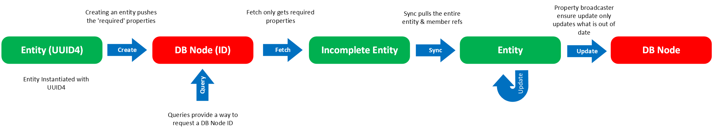

An entity is CREATED – any property marked as required is updated in the store system at the same time. Once created the entity holds a ref to the storage system it is replicated in. The UUID4 of the object is used to key for the entity. All member properties are also created at this time. 

If you change a property on an object – the message broadcast system will mark it for UPDATE, on the next push of system it will be sent to the store. All member properties are updated as well. 

You use FETCH to return an entity from an ID – which can be queried using the connection’s various queries. Consider FETCH like read, but only getting the lightest of representations. Store holds an Entity cache, so you are guaranteed to always get the same entity instance for a given ID. 

Once initially fetched it will be a partially constructed object, just the entity and any required properties – you need to call SYNC to read all the properties. 

DELETE is also supported during push, when the entity is marked for delete. This is only possibly in specific Store edit modes. 

### Data Minimisation 

Given AI datasets can be huge – RMTC is very careful to manage how much of it we pull down from a store, so entities are generally partially constructed – you need to SYNC the entity from the store. This is managed via the member and required flags on properties. A required property is always SYNCed, a member property is only SYNCed if the entity that owns it is SYNCed – this keeps the ecosystem of objects pulled from the store small. 

In addition, properties on entities are carefully setup to only point to the minimal set of items required – for example a Run holds a reference back to Solution, Weights holds a reference back to Model. This arrangement ensures that when you SYNC a solution you don’t pull down all the Runs, or if you want to infer with a given Model, it doesn’t pull down 1000s of Weights or Inference instances. 

This arrangement also maps well to our provenance aims – you generally go backwards up the provenance tree; less commonly do you want to go down. 

### JIT Sync 

The store API is built around explicit SYNCing of entities – to allow the client to manage that behaviour. However, it is possible to define a ‘just in time’ syncing strategy that works in tandem with the Object ACCESSED messages to pull a partial entity from the store when accessing a non-required property. 

This is a little inefficient but is highly convenient. 


## Artifacts 

Artifacts are inferable and trainable entities. They each own a URI location and a way to read and write from that location. They are licensed and permissioned. They are concrete and are created when a client wants to do actual work within RMTC. 

Artifacts are not tied to specific formats – e.g. PyTorch or Keras, RMTC Core provides a PyTorch implementation, but this is easily replaceable. 

### URIs & IO 

An artifact has a binary representation stored at the URI location – however an artifact doesn’t manage how to read and write from that location, this is deferred to an IO instance. This means we can divorce how a model is stored from its functional representation. For example, a Torch model can be stored as a Torchscript model, a Package or even a class and converting between them is a simple matter of changing the IO structure. 

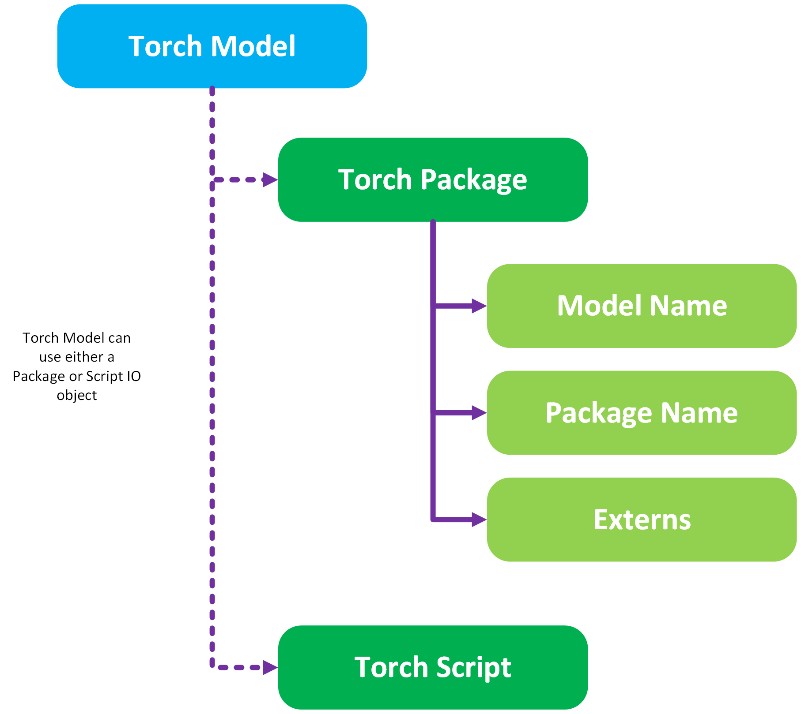

When we publish an asset, its URI is altered to the asset manager’s URI which is then used to transform back into a URI the IO system can operate on. It is possible to create variant artifacts when you publish and change the IO system to something specific to the asset manager – for example Open Asset IO implementations. 

### Licenses & Guardrails 

Every artifact has a license – this is a persistent and shared Entity with a set of permissions. The permissions are a simple set of objects and will form the basis of the training and inferencing guardrails – if a process requires a permission (e.g. a face swap) but the licence isn’t granting that permission, the inference will fail. 

Licenses form the terminus for any provenance trace – essentially telling you where data has come from. 

Licenses are not vetted for fit for purpose and are only indicative. 

### Dataset Types 

Datasets are the base atomic unit for inference and training – as part of the data minimisation strategy we don’t go further in general into asset sets. 

Additionally – datasets are immutable, once created they cannot be changed, otherwise you will undermine the provenance of derived artifacts. 

The primary dataset is a repository – which allows the dataset to use an IO object to populate dynamically its entries. Repositories are like any other Artifact – they are required to be read, written and reset. An example Dataset IO we have is the interleaved image folder IO that loads each alternative EXR in a folder as a source and destination correlate that can be read through the Dataset’s table iterator. 

The second kind is an aggregation, which is a collection of datasets – this is how you tweak a dataset entry – by creating an aggregation of an existing dataset and a new dataset. Iterating through this dataset is one dimensional. 

The final type is collection – which is an explicit collection for asset references. This isn’t common, we want to avoid explicit assets due to storage and retrieval scaling issues. Again, iterating through this dataset is one dimensional. 

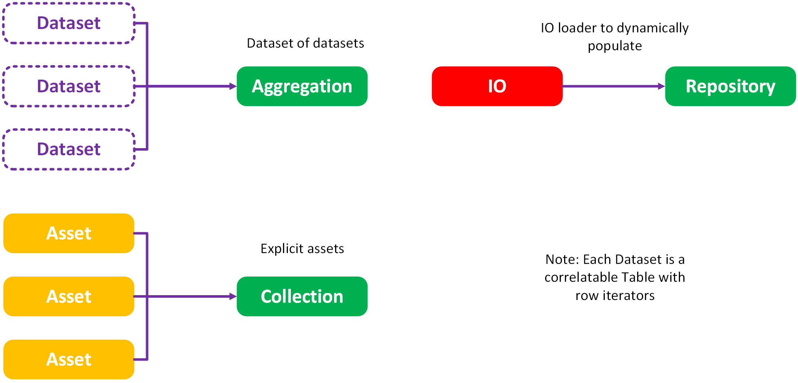

For similar reasons inferences don’t store the assets they create, but a dataset inference. We imagine a DCC executing many real-time inferences, then writing out an entry to reference the resulting assets collectively at the end of the DCC session rather than every instance of those inferences. 

General dataset definition is out of the scope of RMTC – we assume they are fully definable by URI. 

### Ancestors & Variants 

Every artifact can have a connection to something it came from – e.g. a source model or a variant which is an artifact derivation of this entity. 

These relationships differ in a critical way – ancestors do not share the same provenance, variants do. A variant is considered provenance equivalent (the same sources) but in a differing format – e.g. a ONNX variant of a PyTorch model. An ancestor is a source for a given artifact, but the artifact may have additional sources which means its provenance is not equivalent. 

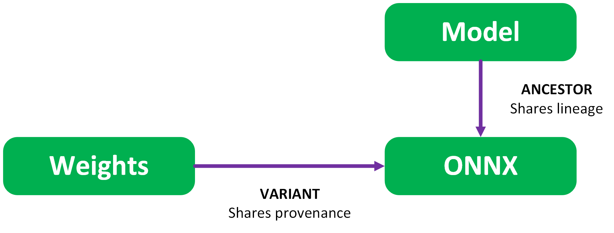

### Metrics 

Trained Artifacts store metrics – Runs, Weights, Checkpoints & Models – as well as Inferences that derive from them. Metrics can be defined on ingestion for external models. 

This metric is assigned during training and is a normalized 0-1 value. Ideally from a validation dataset (not yet supported). 

Metrics are how we select best run – given a solution, find the best completed run with the lowest metric. 

### Tensor Formats 

One issue with AI is the various standards of asset and tensor formats. We try and insulate the models and assets using standardized internal representations.  

For tensors we use NumPy – not ideal as CPU specific and should be replaced. Assets store their tensors as volatile NumPy tensors on read via their IO object. 

Each asset has a particular RMTC format – for Images we use 1HWC RGBA. This is to align with future memory mapping. For meshes we intend to adopt a Vulcan mappable structure. 

For example consider an interleaved RGB image format vs a planar RGB image:

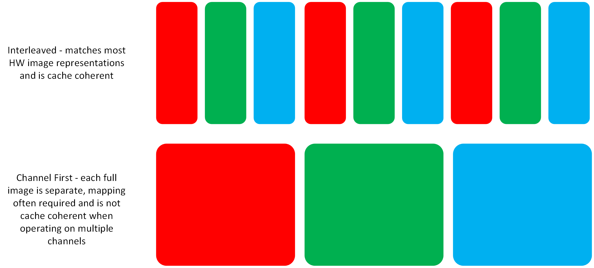
 
When we go to infer we need to convert that standard representation to a model specific representation e.g. BCHW for PyTorch image inferencing – this is where processors come in. 

### Processors

A processor is an invertible operation that converts the tensors to another format. These differ to PyTorch transforms as they can operate in 2 directions – taking an asset to a model input or output format and back. 

Every processor has a ```run``` and ```run_inverse``` method which should mirror each other - sometimes this is not possible when information is lost in one of the directions. Each processor has a specific tensor input and output shape to allow for runtime checking, though this is often bypassed at the minute.

The key processors that exist:
* Process - the base class
* Process Stack - an ordered list of operations, the result of one passed to the next - is invertable
* Process Inverse - inverts the operations

Note - that we generally don't deal with tensor batches in RMTC - the system passes lists of assets and the trainer runs the batching by collating into lists. A processor specifically collates this list of tensors into a single batch - for immediate passing into a model.

We currently have a number of basic operations:
* Agument - rotation, flip, scale, translate augmentation operations
* Channel - Image channel operations like remove alpha, channel reordering
* Structure - basic tensor operations like bath and flatten
* Color - normalisation operations

Processors are also used as a preprocess during training for augmentation (e.g. randomized resizing) and post inference processing – image normalisation etc. 

### Models, Weights & Checkpoints 

Within RMTC we make the distinction between these 3 items – Weights are paired with Models, a model is duplicated then the weights loaded, to ensure we could have multiple models in memory with separate weights.  

Checkpoints are intended to store additional training information to ensure we can restart training exactly as it was left off – Weights should strip that information down to only what is needed for inference. 

In the case of inferable only models – e.g. ONNX, we create it as a variant of the Weights object during the pipeline build and mark it as an ancestor of the source model. 

## Train 

Train provides the interface for running a trainer in a Run against a Dataset and Model. This requires the artifacts are correctly wrapped and exposed to the store. 

### Solutions & Runs 

A solution can be considered the ‘project’ in RMTC. It is a solution to a problem – with the runs being attempts to better solve that problem. A solution holds signature information and a path to place runs within.  

Ideally a client would reference the solution rather than a model so that the best run can be dynamically selected – and if a dataset or model is revoked, an alternative can be programmatically found, 

A run holds a reference back to a solution for scalability reasons – it holds the trainer information and the run status. 

### Scheduling 

Runs are not trained directly – they are deferred to a scheduler. Currently this is defined internally to the train module but should be broken out to allow the inference to run with the same architecture. 

Scheduling creates jobs which execute. There are a local implementation and a wall-based solution that is currently implemented with a facility specific system that is not released with the overall RMTC code. This is an ideal first implementation task to support OpenCue for Deadline or something similar. 

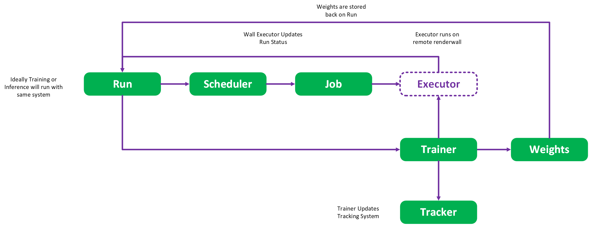

### Trainers & Trackers 

The training task itself is deferred to a technology – currently PyTorch and a simple correlated regression trainer. This works directly at the PyTorch level but must follow some basic requirements – the dataset needs to be read, and the resulting assets need to be loaded before converting to input and output model formats. 

Checkpoints are written out at a determined cadence and once complete the trainer returns the resulting weights, model and metrics to the Run for storage. 

The location for the checkpoints and weights is determined relative to the solution and stored in a manner that the trainer decides. 

All the while a deferred tracking system, Tensorboard at present, is used to log various progress information. This is stored again relative to the solution URI. 

### Augmentation 

To support coarse augmentation, the trainer can accept a preprocessor process stack – which adjust the incoming asset tensors. If the trainer is set to repeat – that will revisit the same elements in the dataset but transform them randomly according to the preprocessor, giving a rough chance for augmentation. 

For more complex augmentation – the system defers to the client creating their own rich synthetic datasets. 

## Infer 

Inference is a lean module that wraps basic dataset to dataset inference. 

### Inferers 

An inferer generates an inference instance from a given dataset, weights and model. The resulting inference will refer to a new dynamically created dataset – which can be written out if required. The client can provide the type of dataset to populate, and the IO related to writing to the URI. 

DCC plugins would also be considered an inferer – inferers do not own the monopoly on creating inference. An inference can be constructed directly from System for any potential non-RMTC inference system. 

Inferers are not stored directly as they are in practice fungible – the model, weights, input and outputs are all recorded which should be enough to recreate any inference. 

The inferer is currently not scheduled, though this should be a future feature to add.  

### Inferencing & Datasets 

Inferences manage input and output datasets – they don’t generate lists of assets. This is an important part of data minimisation. 

The way in which labelling and annotation work in the inference system could be improved – RMTC assumes an Asset-to-Asset transformation in inference. For Values asset types it is an Asset-to-Asset Element transformation which is poorly managed – this can be seen in the MNIST example. This structure needs revisiting. 

### A Note on Performance 

The image tensor format is a HWC RGBA format, and the intended Mesh representation is a mappable Vulcan vertex format – this is non-standard to PyTorch/ImageNet. The motive here is to enable future memory mapping – channels last format is closer to the interleaved format often used in memory for DCCs and real time contexts. This is intentional and is there to encourage performant inferencing and faster training. 

### DCC Inference 

The idea is that a DCC or TD would refer to a solution in their pipeline rather than a model. RMTC would pull the best quality Run and execute the inference. This of course can be overridden to use specific models or weights as per the shot requires. 

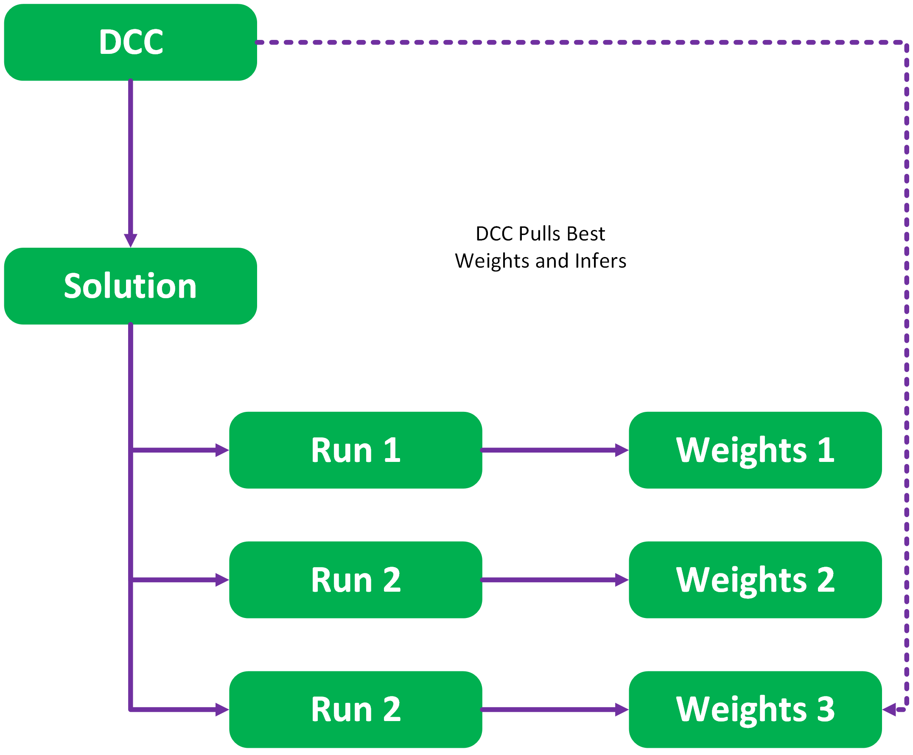

The signature in such case would be used to setup the marshalling operations for the data from the DCC to RMTC formats. The model itself would have a process stack consisting of properties and type names of those processes - which would be instantiated into a real time process tack implementations for transformation of the data to the model format – ideally a limited memory mappable representation can be used. 

## Pipeline 

What sets RMTC apart from other ML/AI frameworks is the focus on VFX concepts such as pipelining. In the context of RMTC a pipeline refers to take an Artifact, building into a context specific format and publishing to an external asset management system. 

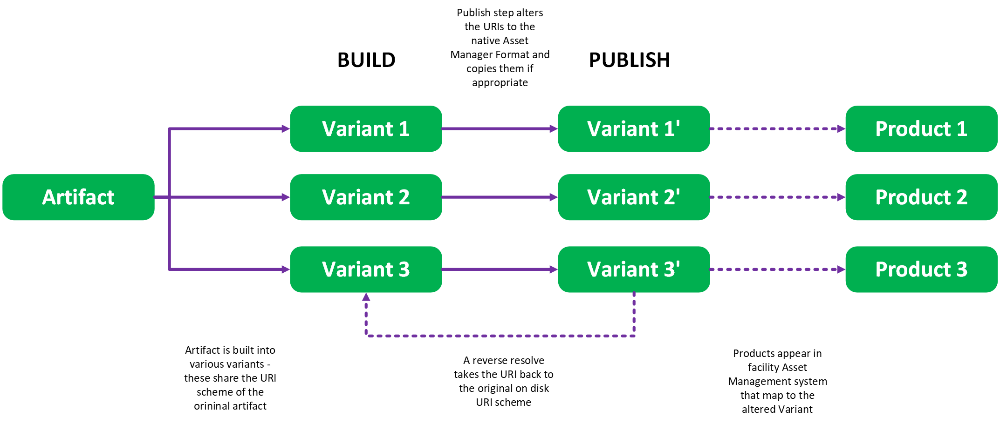

### Building 

RMTC allows for the transformation of artifacts using a set of per Artifact type builder. This can be selected by the client to run over a Model, Weights or Dataset and become a series of derived Artifacts – all marked as variants of the original Artifact.  

For example, a combination of Model and Weights files can be converted to a Torch script model and then a CAT file for Nuke execution. The two products marked as variants of the original Weights file and ancestors of the Model. 

Any unknown Artifacts in RMTC are exposed as ‘Resources’ - for example the Nuke CAT file. 

### Asset Management 

Artifacts are written and read through an asset manager which operates on transforming the associated URI to and from an Asset Manager specific URI. The scheme of the URI (“file” for example) can be used to key how to transform the URI. 

Publishing an asset passes it to the instantiated asset manager – the default is a simple filesystem manager and transforms the artifact URI. 

Asset Managers store the Artifact Builds - if one is defined then the builder is executed prior to publish so the built Artifact is the item that is published to the system. 

In addition, the IO object can be transformed by the publish step allowing a system to defer the Artifact IO to specialized per Asset Manager systems. 

## GUI 

We have 2 main GUIs currently: a provenance tracker and an ingestion system – which are hosted in a central Qt applcation and look like the following: 

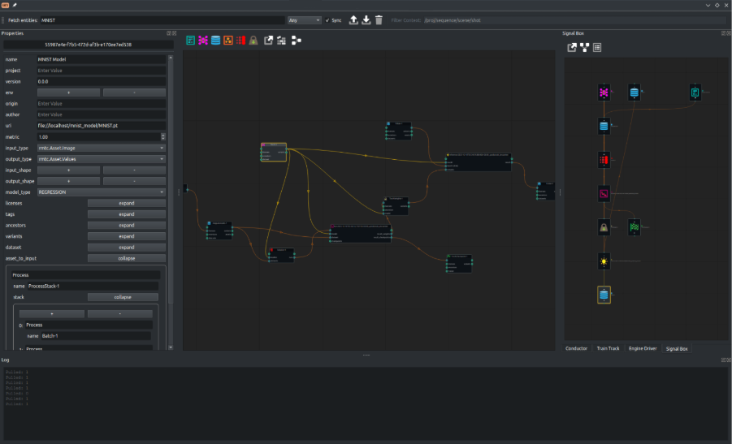

The main edit window is a Qt wrapper that extends the NodeGraphQt graphing library to provide methods for ingesting external artifacts and tracing the resulting provenance.

The RMTC-GUI holds instances to several tools mentioned below, however these tools are prototypes at present and likely to be unified into a more holistic solution. There are additional UIs in development for training management – these portions are managed by the python API at present.

The DAG editor is only partially implemented – removing noodles is not fully operational. 

### Shared System 

The GUI sits and listens to the System object updates and reflects the changes that occur. This means all tools share the same backend – searching and fetching entities from the storage system will cause every tool instantiated to reflect the contents of the local System objects model. 

### Properties 

The common property widgets allow the Qt client to create a property editor for viewing Entity Properties – it listens to the sync state of the entities so shows what is available. For any member property it allows you to expand and collapse the properties as required. 


### Train Track 

This is an upcoming tool to allow you to monitor training sessions and publish results. 

It queries the runs in the solution and provides visual feedback to the metric and status. It will additionally tie into the Tracker system (TensorBoard) to allow you view intermediate inferences. 

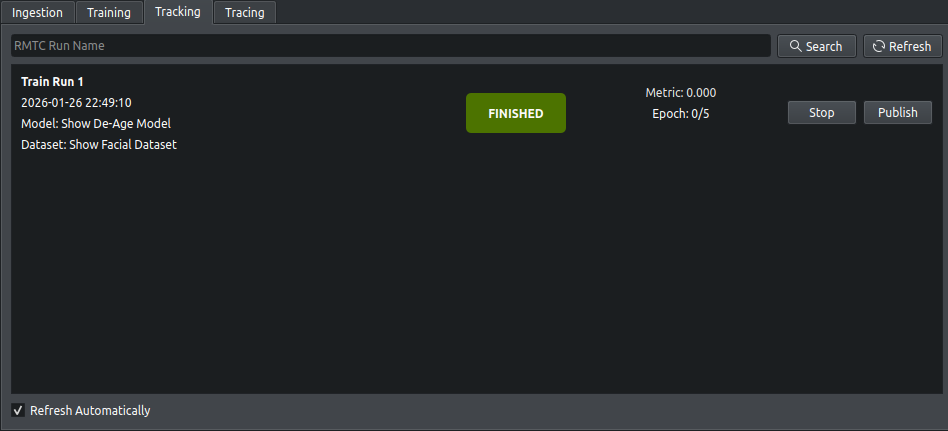

Train Track will ultimately allow the client to restart and tweak jobs on the render farm. 

This is likely to be merged with Conductor. 

## Scheduler 

Scheduler is a placeholder module to provide inspiration of where any future wall scheduler may go for a shared implementation for inference & training. 

## Environment 

Environment is an additional placeholder module to provide a rough location for package and environment management. 

Package management is something we need to defer to facilities to inject at the System level. It is essential for allow models with unresolved dependencies to be instantiated. 

## Interface 

Interface is a placeholder module to define a potential REST Server & Client architecture. 

RMTC’s domain lends itself naturally to web interfaces – this is not currently the case as it operates in a traditional VFX Python session. 

Interface will be a method to bridge between 2 Systems – with the Server system connecting through to the remote storage. 

---
SPDX-License-Identifier: Apache-2.0 - Copyright Contributors to the RMTC Project